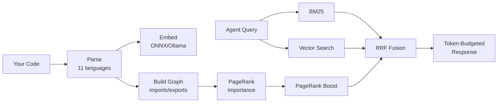

<p align="left">
  
</p>

> **The only code-intel MCP with a published benchmark and reproducible eval harness.**
> Local-first MCP server that gives Claude Code, Cursor, Windsurf, and Zed a real symbol graph, a blast-radius lens, and a git-pinned memory — so the agent stops guessing. MIT. Zero config. Your code never leaves the machine.
>
> [Paper (Zenodo, CC BY 4.0)](https://doi.org/10.5281/zenodo.19802051) · [bench:primitives](./benchmark/) — sverklo cuts agent context by **65 % vs grep** (255 vs 731 tokens per task, n=60) · [bench:swe](https://sverklo.com/blog/bench-swe-first-results/) — 38/65 perfect recall on 5 OSS repos, including the runs we lose.

[](https://www.npmjs.com/package/sverklo)
[](https://www.npmjs.com/package/sverklo)
[](LICENSE)
[](https://sverklo.com/report)
[](https://doi.org/10.5281/zenodo.19802051)


## Why

Your AI agent edits `UserService.validate()`. It doesn't know 47 other functions call it. It hallucinates `getUserByEmail()` because that's how its training data spelled it — your code uses `findByEmail()`. It forgets the design decision you made yesterday because context was compacted. Tests pass because they mock the dependency. Breaking changes ship.

Sverklo drills into your repo before the agent does — symbol graph, blast radius, semantic recall, and git-pinned memory — so the agent reasons about *your* code instead of pattern-matching from training data.

<table>
<tr>
<td align="center"><b>37</b><br/>MCP tools your agent uses</td>
<td align="center"><b>&lt; 2 s</b><br/>to index a 1,700-file monorepo</td>
<td align="center"><b>0 bytes</b><br/>of your code leave the machine</td>
</tr>
</table>

```bash
npm install -g sverklo
cd your-project && sverklo init
```

That's it. `sverklo init` auto-detects your installed AI coding agent (Claude Code, Cursor, Windsurf, Zed), writes the right MCP config, appends instructions to `AGENTS.md` if present (otherwise `CLAUDE.md`), and runs `sverklo doctor` to verify the setup. Works on macOS, Linux, and Windows. **No API keys. No cloud. Telemetry off by default.**

> The embedding model (`all-MiniLM-L6-v2` ONNX, ~86 MB) is downloaded from HuggingFace on first use into `~/.sverklo/models/` and cached forever — every subsequent run is fully offline.

**Want proof before installing?** Browse the [/report leaderboard](https://sverklo.com/report) — Sverklo audits of 47 popular OSS repos (express, react-hook-form, vite, lodash, prisma, …) with grade cards for dead code, circular deps, coupling, and security.

---

## What's new in 0.18

- **Vue.js (.vue) support.** Single-file components are now first-class: the `<script>` block parses through the existing TS/JS pipeline (with line remapping back to the SFC), Composition API helpers (`ref`, `computed`, `reactive`, `defineProps`, …) are indexed as symbols, and PascalCase template tags emit relative imports so PageRank sees component graphs. Also fixes a preexisting TS bug where `import type { X } from 'y'` was missed.
- **AGENTS.md aware `sverklo init`.** When [AGENTS.md](https://agents.md) exists, the prefer-sverklo block is appended there instead of `CLAUDE.md`. `sverklo doctor` flags drift between the two files so multi-agent setups stay in sync.
- **Windows pathing fixed.** `sverklo init` and `sverklo doctor` now work on Windows — absolute paths go through `path.basename()` and stored `relativePath` is normalized to forward slashes so every downstream consumer is cross-platform.
- **`npm run bench:swe`** — third-party-reproducible cross-repo eval. Clones 5 OSS repos (express, nestjs, vite, prisma, fastapi), runs 65 grounded questions, prints aggregated recall. PRs that add questions are welcome.
- **Tree-sitter parser opt-in.** `sverklo grammars install` (~3.5 MB across 6 languages) + `SVERKLO_PARSER=tree-sitter` routes the indexer through real ASTs for TypeScript/TSX/JavaScript/Python/Go/Rust. Silent regex fallback when grammars aren't installed. Plan to flip the default lives in [docs/parser-parity.md](./docs/parser-parity.md).
- **Workspace shared memory.** `sverklo workspace memory <name> add/list/search` plus `sverklo_remember scope:"workspace"` from the agent — write a decision once, query it from every other repo in the workspace. `sverklo_recall` blends workspace results under project ones with a `[ws]` badge.
- **`sverklo memory export`** — markdown / Notion / JSON. Migrate your team's decision log to wherever it actually lives.
- **PR-bot inline review.** `sverklo review --format github-review-json` + the action's new `inline-comments: true` default posts per-line review comments via `pulls.createReview`, alongside the existing sticky summary.
- **VS Code extension scaffold** at [`extensions/vscode/`](./extensions/vscode/) with a pre-built `sverklo-vscode-0.1.0.vsix`. Inline caller-count decorations on every function header (`⟵ 47 callers`). Marketplace publish workflow ships dormant; install with `code --install-extension extensions/vscode/sverklo-vscode-0.1.0.vsix` today.
- **`sverklo digest [--since 7d]`** — 5-line summary of audit-grade trend, new vs stale memories, and high-PageRank files touched. Wire into a shell-hook on `cd` for a daily sverklo check-in.

---

## Grep vs Sverklo — the same question, side by side

Every one of these is a query a real engineer asked a real AI assistant last week. Grep gives you lines. Sverklo gives you a ranked answer.

| The question | With Grep | With Sverklo |
|---|---|---|
| "Where is auth handled in this repo?" | `grep -r 'auth' .` -- 847 matches across tests, comments, unrelated vars, and one 2021 TODO | `sverklo_search "authentication flow"` -- top 5 files ranked by PageRank: middleware, JWT verifier, session store, login route, logout route |
| "Can I safely rename `BillingAccount.charge`?" | `grep '\.charge('` -- 312 matches polluted by `recharge`, `discharge`, `Battery.charge` fixtures | `sverklo_impact BillingAccount.charge` -- 14 real callers, depth-ranked, with file paths and line numbers |
| "Is this helper actually used anywhere?" | `grep -r 'parseFoo' .` -- 4 matches in 3 files. Are any real, or just string mentions? Read each one. | `sverklo_refs parseFoo` -- 0 real callers. Zero. Walk the symbol graph, not the text. Delete the function. |
| "What's load-bearing in this codebase?" | `find . -name '*.ts' \| xargs wc -l \| sort` -- the biggest files. Not the most important ones. | `sverklo_overview` -- PageRank over the dep graph. The files the rest of the repo depends on, not the ones someone wrote too much code in. |
| "Review this 40-file PR — what should I read first?" | Read them in the order git diff printed them | `sverklo_review_diff` -- risk-scored per file (touched-symbol importance x coverage x churn), prioritized order, flagged production files with no test changes |

If the answer to your question is "exact string X exists somewhere," grep wins. Use grep. If the answer is "which 5 files actually matter here, ranked by the graph," you need sverklo.

---

## Works with every MCP editor

| Editor | MCP | Skills | Hooks | Auto-setup |
|--------|:---:|:------:|:-----:|:----------:|
| Claude Code | yes | yes | yes | `sverklo init` |
| Cursor | yes | — | — | `sverklo init` |
| Windsurf | yes | — | — | `sverklo init` |
| Zed | yes | — | — | `sverklo init` |
| VS Code | yes | — | — | manual |
| JetBrains | yes | — | — | manual |
| Antigravity | yes | — | — | `sverklo init` |
| Any MCP client | yes | — | — | `npx sverklo /path` |

---

## Hero tools

| Tool | What it does |
|------|-------------|
| `sverklo_search` | Hybrid BM25 + vector + PageRank search. Find code without knowing the literal string. |
| `sverklo_refs` | All references to a symbol, with caller context. Proves dead code with certainty. |
| `sverklo_impact` | Walk the symbol graph, return ranked transitive callers — the real blast radius. |
| `sverklo_review_diff` | Risk-scored review of `git diff`: touched-symbol importance x coverage x churn. |

[See all 37 tools below.](#full-tool-reference)

<details>
<summary><h2>Full tool reference</h2></summary>

### Search — find code without knowing the literal string
| Tool | What |
|------|------|
| `sverklo_search` | Hybrid BM25 + ONNX vector + PageRank, fused with Reciprocal Rank Fusion |
| `sverklo_overview` | Structural codebase map ranked by PageRank importance |
| `sverklo_lookup` | Find any function, class, or type by name (typo-tolerant) |
| `sverklo_context` | One-call onboarding — combines overview, code, and saved memories |
| `sverklo_ast_grep` | Structural pattern matching across the AST, not just text |

### Impact — refactor without the regression
| Tool | What |
|------|------|
| `sverklo_impact` | Walk the symbol graph, return ranked transitive callers (the real blast radius) |
| `sverklo_refs` | Find all references to a symbol, with caller context |
| `sverklo_deps` | File dependency graph — both directions, importers and imports |
| `sverklo_audit` | Surface god nodes, hub files, dead code candidates in one call |

### Review — diff-aware MR review with risk scoring
| Tool | What |
|------|------|
| `sverklo_review_diff` | Risk-scored review of `git diff` — touched-symbol importance x coverage x churn |
| `sverklo_test_map` | Which tests cover which changed symbols; flag untested production changes |
| `sverklo_diff_search` | Semantic search restricted to the changed surface of a diff |

### Memory — bi-temporal, git-aware, never stale
| Tool | What |
|------|------|
| `sverklo_remember` | Save decisions, patterns, invariants — pinned to the current git SHA |
| `sverklo_recall` | Semantic search over saved memories with staleness detection |
| `sverklo_memories` | List all memories with health metrics (still valid / stale / orphaned) |
| `sverklo_forget` | Delete a memory |
| `sverklo_promote` / `sverklo_demote` | Move memories between tiers (project / global / archived) |

### Index health
| Tool | What |
|------|------|
| `sverklo_status` | Index health check, file counts, last update |
| `sverklo_wakeup` | Warm the index after a long pause; incremental refresh |

</details>

---

## When to reach for sverklo — and when not to

We're honest about this. Sverklo isn't a magic 5x speedup and it doesn't replace grep. It's a sharper tool for specific jobs.

**When sverklo earns its keep:**
- You don't know exactly what to search for
- You need to prove dead code (zero references across the whole symbol graph)
- You need the blast radius of a refactor before you start
- You're reviewing a large PR and need to know what to read first

**When grep is still the right tool:**
- Exact string matching — "does this literal string exist?"
- Small codebases under ~50 source files — just read everything
- Single-file diffs — `git diff` + `Read` is hard to beat
- Build and test verification — only `Bash` runs `npm test`

If a launch post tells you a tool is great for everything, close the tab.

---

## Common questions

### How do I stop Claude Code from hallucinating about my codebase?

Claude generates code from training-data patterns, not your repo. Without a symbol graph, it invents `getUserByEmail()` when your code uses `findByEmail()`. Sverklo grounds the agent in your actual symbol graph — `sverklo_lookup` and `sverklo_refs` resolve names to `file:line` and prove existence before the agent writes the call. Verifiable retrieval (`sverklo_verify`) lets the agent re-check that a quoted span is still present at the cited SHA, so a stale citation gets caught instead of confabulated.

### Is there a local-first MCP server for codebase memory?

Yes — sverklo. `sverklo_remember` and `sverklo_recall` ship a bi-temporal memory layer: every memory is pinned to the git SHA it was authored on, and `valid_until_sha` + `superseded_by` preserve a timeline of supersessions instead of overwriting. Recall is hybrid (FTS5 + cosine over an ONNX embedding) and runs entirely in embedded SQLite. No cloud, no API keys, no external vector database — unlike most "memory MCP" projects which require Zilliz, Milvus, or a managed Postgres+pgvector.

### Is there an open-source alternative to Sourcegraph Cody I can run locally?

Sverklo is the open-source local alternative to Sourcegraph Cody for codebase Q&A: hybrid BM25 + vector + PageRank retrieval, symbol-graph navigation, MIT-licensed instead of source-available, single-machine instead of Cody's enterprise deployment, and free instead of $9–19 per developer per month. Sverklo doesn't try to ship the same feature set — it's a primitives layer for AI coding agents (37 MCP tools), not a hosted IDE plug-in — but for the "give the agent semantic understanding of my codebase" job, it covers the same surface.

### Where does my code go when I use sverklo?

Nowhere. Sverklo runs entirely on your machine. Indexing, search, embeddings, audits, and PR review all execute locally with embedded SQLite plus a local ONNX embedding model. The model itself is downloaded from HuggingFace on first run (~86 MB), cached in `~/.sverklo/models/`, and never touched again. Telemetry is opt-in and off by default — sverklo makes zero network calls unless you explicitly run `sverklo telemetry enable`.

### Does sverklo work with Cursor's @codebase or Cursor Tab?

Sverklo runs alongside Cursor's built-in indexing rather than replacing it. Cursor's @codebase ships embedding-based search inside the IDE; sverklo adds the symbol graph, blast radius, diff-aware risk-scored review, and bi-temporal memory that Cursor doesn't expose. Wire sverklo as an MCP server in Cursor and both layers are available to the agent simultaneously. The same setup works for Claude Code, Windsurf, Zed, Antigravity, and anything else that speaks MCP.

---

## Three retrieval techniques you'll only find here

Most code-search MCPs are a single BM25 + vector RRF on top of Milvus or pgvector. Sverklo's recall is built on three named moves that work because they exploit *codebase structure*, not just text similarity. Each one was added to close a real recall failure on real questions; together they're the reason sverklo's research benchmark hits 99% recall (31 of 32) without a managed vector database.

### 1. Filename-as-signal retrieval

When a query token matches a *filename* — even when the body of that file doesn't FTS-match — sverklo pulls every named definition in that file into the candidate set. Conversely, when FTS surfaces a file at all (because of a comment hit, an import line, anything), every definition in that file becomes a plausible answer. This is the single move that closes the "private helper function" gap: the function is too short for embeddings to disambiguate and uses a name no one would `grep` for, but it lives next to the code that *does* match. Implemented in `src/search/investigate.ts` (`runDefinitionsByPathTokens`, `runDefinitionsInFtsFiles`).

### 2. Channelized RRF fusion

Most hybrid retrievers run *one* Reciprocal Rank Fusion over `fts ∪ vector` and call it a day. Sverklo runs RRF *per channel* — FTS, vector, doc-section, path, symbol-name — then fuses the per-channel ranks with channel-specific weights. The path channel is weighted **1.5×** because filename matches are precision-skewed; doc chunks score in their own channel so a 200-line markdown section can't drown a 4-line function body. This is structural retrieval, not just lexical-vs-semantic. Implemented in `src/search/investigate.ts` (per-channel RRF + weighted fusion).

### 3. Bi-temporal memory with `superseded_by` lineage

Every memory carries `valid_from_sha` and `valid_until_sha`. Updating a memory doesn't overwrite — it inserts a new row, sets `valid_until_sha` on the old one, and links them via `superseded_by`. Recall queries naturally exclude invalidated rows, but the timeline view keeps everything, so you can ask "what did this team believe about the auth flow at commit `abc123`?" and get the answer that was true *then*. `sverklo prune` consolidates clusters of similar episodic memories into one semantic note while preserving the lineage. Implemented across `src/storage/memory-store.ts` and `src/memory/prune.ts`.

---

## How It Works



1. **Parses** your codebase into functions, classes, types (TS, JS, Vue, Python, Go, Rust, Java, C, C++, Ruby, PHP)
2. **Embeds** code using all-MiniLM-L6-v2 ONNX model (384d, fully local) — or any Ollama model via config
3. **Builds** a dependency graph and computes PageRank (structurally important files rank higher)
4. **Searches** using hybrid BM25 + vector similarity + PageRank, fused via Reciprocal Rank Fusion
5. **Remembers** decisions and patterns across sessions, linked to git state
6. **Watches** for file changes and updates incrementally

---

## Performance

Real measurements on real codebases. Reproducible via `npm run bench` ([methodology](./BENCHMARKS.md)).

| Repo | Files | Cold index | Search p95 | Impact analysis | DB size |
|---|---:|---:|---:|---:|---:|
| [gin-gonic/gin](https://github.com/gin-gonic/gin) | 99 | 10 s | 12 ms | 0.75 ms | 4 MB |
| [nestjs/nest](https://github.com/nestjs/nest) | 1,709 | 22 s | 14 ms | 0.88 ms | 11 MB |
| [facebook/react](https://github.com/facebook/react) | 4,368 | 152 s | 26 ms | 1.18 ms | 67 MB |

- **Search p95 stays under 26 ms** even on a 4k-file monorepo
- **Impact analysis is sub-millisecond** — indexed SQL join, not a string scan
- **11 languages:** TS, JS, Vue, Python, Go, Rust, Java, C, C++, Ruby, PHP

---

## Quick Start

### Claude Code

```bash
npm install -g sverklo
cd your-project && sverklo init
```

Creates `.mcp.json` at your project root and appends sverklo instructions to `CLAUDE.md`. Safe to re-run. If sverklo doesn't appear in `/mcp` after restart, run `sverklo doctor`.

### Cursor / Windsurf / VS Code / JetBrains

Use the full binary path (`which sverklo`) to avoid PATH issues in spawned subprocesses:

```json
{
  "mcpServers": {
    "sverklo": {
      "command": "/full/path/to/sverklo",
      "args": ["."]
    }
  }
}
```

Config locations: `.cursor/mcp.json`, `~/.windsurf/mcp.json`, `.vscode/mcp.json`, or JetBrains Settings -> Tools -> MCP Servers.

### Antigravity

`sverklo init` writes the global config at `~/.gemini/antigravity/mcp_config.json`. Because Antigravity lacks per-project MCP config, you'll need to re-run `sverklo init` from each project or use separate keys (`sverklo-projA`, `sverklo-projB`).

### Any MCP client

```bash
npx sverklo /path/to/your/project
```

> **First run:** The ONNX embedding model (~90 MB) downloads automatically. Takes ~30 seconds on first launch, then instant.

---

## Why not... (as of 2026-04)

| Alternative | Local | OSS | Code search | Symbol graph | Memory | MR review | License | Cost |
|---|---|---|---|---|---|---|---|---|
| **Sverklo** | yes | yes MIT | hybrid + PageRank | yes | git-aware | risk-scored | MIT | $0 |
| Built-in grep / Read | yes | yes | text only | no | no | no | varies | $0 |
| [Cursor @codebase](https://docs.cursor.com/context/codebase-indexing) | no (cloud) | no | yes | partial | no | no | proprietary | with Cursor sub |
| [Sourcegraph Cody](https://sourcegraph.com/cody) | no (cloud) | no | yes | yes | no | partial | source-available | $9-19/dev/mo |
| [Claude Context (Zilliz)](https://github.com/zilliztech/claude-context) | no (Milvus) | yes | vector only | no | no | no | MIT | $0 + Milvus |
| [Aider repo-map](https://aider.chat/docs/repomap.html) | yes | yes | no | basic | no | no | Apache 2.0 | $0 |
| [Greptile](https://greptile.com) | no (cloud) | no | yes | yes | no | yes | proprietary | $30/dev/mo |

---

## Audit formats

`sverklo audit` generates codebase health reports in six formats: `markdown`, `html`, `json`, `sarif`, `csv`, and `badges`. Run `sverklo audit --format html --open` for a self-contained report with god nodes, hub files, orphan detection, coupling analysis, and language distribution. Use `sverklo audit --badge` to add an A-F health grade shield to your README.

---

## CLI tools

Sverklo ships a CLI for CI and local use: `sverklo review --ci --fail-on high` for risk-scored diff review (auto-detects PR ref in GitHub Actions), `sverklo audit` for codebase health reports, and a [GitHub Action](./action) that posts review comments on PRs. Run `sverklo audit-prompt` or `sverklo review-prompt` to get battle-tested workflow prompts you can paste into any agent.

---

## Claude Code hooks recipe

Sverklo plays well with [Claude Code hooks](https://docs.claude.com/claude-code/hooks). The simplest hook to wire is a post-tool-use review: after Claude makes file edits, run `sverklo review` against the working tree and surface any high-risk findings in the agent transcript. Add this to `~/.claude/settings.json`:

```json
{
  "hooks": {
    "PostToolUse": [
      {
        "matcher": "Edit|Write",
        "hooks": [
          {
            "type": "command",
            "command": "sverklo review --ref HEAD --format json --fail-on high || true"
          }
        ]
      }
    ]
  }
}
```

The trailing `|| true` keeps the hook from blocking edits when sverklo isn't installed or the working tree has no diff yet. For project-scoped hooks, put the same block in `.claude/settings.json` at the repo root instead.

---

## Telemetry

**Off by default.** Sverklo makes zero network calls unless you explicitly run `sverklo telemetry enable`. If you opt in, we collect only anonymous usage metrics (no code, no queries, no file paths). Full schema and implementation details in [`TELEMETRY.md`](./TELEMETRY.md).

---

## Open Source, Open Core

The full MCP server is **free and open source** (MIT). All 37 tools, no limits, no telemetry, no "free tier" — that's not where the line is.

**Sverklo Pro** (later this year) adds smart auto-capture of decisions, cross-project pattern learning, and larger embedding models. **Sverklo Team** adds shared team memory and on-prem deployment.

The open-core line: **Pro adds new things, never gates current things.** Anything in the OSS server today stays in the OSS server forever.

---

## Links

- [Website](https://sverklo.com)
- [npm](https://www.npmjs.com/package/sverklo)
- [Issues](https://github.com/sverklo/sverklo/issues)
- [First Run Guide](FIRST_RUN.md)
- [Benchmarks](BENCHMARKS.md)
- [Paper (Zenodo, CC BY 4.0)](https://doi.org/10.5281/zenodo.19802051)

## Citing Sverklo

If you use Sverklo or its benchmarks (`bench:primitives`, `bench:swe`) in research, please cite:

> Groshin, N. (2026). *Sverklo: A Local-First Code Intelligence MCP Server and a Cross-Repository Software Engineering Benchmark*. Zenodo. https://doi.org/10.5281/zenodo.19802051

BibTeX:

```bibtex
@misc{groshin2026sverklo,
  author    = {Groshin, Nikita},
  title     = {{Sverklo}: A Local-First Code Intelligence {MCP} Server and a Cross-Repository Software Engineering Benchmark},
  year      = {2026},
  publisher = {Zenodo},
  doi       = {10.5281/zenodo.19802051},
  url       = {https://doi.org/10.5281/zenodo.19802051}
}
```

## License

MIT
